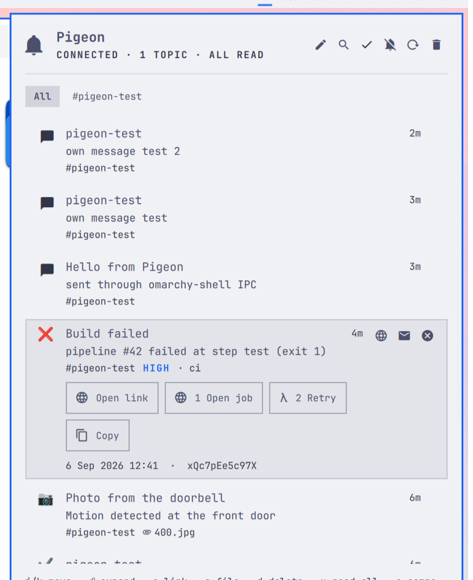

# Pigeon

A [ntfy](https://ntfy.sh) inbox for the [Omarchy](https://omarchy.org) bar. Pigeon keeps a live
subscription open to ntfy.sh or your own self-hosted server and turns every message into an
Omarchy toast plus an entry in a themed popup inbox.



## What you get

- **Live stream, not polling.** One `curl` JSON stream per subscription, automatic reconnect with
  backoff, a keepalive watchdog, and catch-up of anything missed while the laptop slept.
  Adding a topic pulls its recent history (the `backfill` window) from the server's cache
  automatically; `r` reloads it on demand. Removing a topic removes its messages, like
  unsubscribing in the ntfy apps. Deleted messages stay deleted.
- **Self-hosted first.** Anonymous, bearer token, or basic auth. Credentials are passed to curl
  through the process environment, so they never show up in `ps`.
- **Bar pill** with a pigeon glyph and unread count. Follows the theme: accent colour when
  something is unread, the theme's "active" colour when a high or urgent message is waiting,
  dimmed when disconnected. Works in the left, center, or right section and on vertical bars.
- **Native Omarchy toasts** with the message's emoji tag as glyph, ntfy priority mapped to
  urgency, and a click that opens the message's link or the Pigeon panel.
- **Inbox panel** with topic tabs, search, unread dots, expand-in-place, image attachment
  preview, ntfy `view` and `http` actions, open link, copy, delete, mark read / unread, mark all
  read, clear, mute, reconnect, and full keyboard navigation.
- **Compose box** to publish to any topic on your server with a title and priority.
- **IPC** so scripts can publish, mute, or read status through `omarchy-shell`.
- Inbox and read state survive shell restarts (`~/.local/state/omarchy/pigeon/state.json`).

## Requirements

Omarchy 4 shell, `curl`, `jq`, `wl-copy`. All of them ship with Omarchy.

## Install

```bash
omarchy plugin add https://github.com/<you>/omarchy-pigeon.git --enable
omarchy bar set xyzlab.pigeon server https://ntfy.example.com
omarchy bar set xyzlab.pigeon topics alerts,home
```

The widget lands in the right section. Move it anywhere:

```bash
omarchy bar move xyzlab.pigeon --section center
omarchy bar move xyzlab.pigeon --section left --index 2
```

Pigeon has no default topic on purpose: an unprotected topic name is a public address.

## Settings

Press `s` (or the gear) in the panel to open the settings editor: server, topics, auth,
toasts, bar options, and inbox limits, with Save and Cancel. Enter saves, Esc cancels, Tab
moves between fields. Everything it writes lands inline on the widget entry in
`~/.config/omarchy/shell.json`, so the CLI form below edits exactly the same values.
Changes apply live either way.

| Key | Default | Meaning |
| --- | --- | --- |
| `server` | `https://ntfy.sh` | Base URL of the ntfy server (reverse-proxy prefixes are fine) |
| `topics` | `""` | Comma separated topic names to subscribe to |
| `auth` | `none` | `none`, `token`, or `basic` |
| `token` | `""` | Access token for `auth = token` (`ntfy token add` or the web UI) |
| `username` / `password` | `""` | Credentials for `auth = basic` |
| `toasts` | `true` | Show Omarchy desktop toasts for new messages |
| `toastMinPriority` | `2` | Lowest ntfy priority (1 to 5) that produces a toast |
| `backfill` | `all` | History to load for a new topic: everything the server still caches, or `12h`, `3d`, `none` |
| `maxMessages` | `200` | Messages kept in the inbox |
| `allowHttpActions` | `false` | Let publisher-defined `http` actions run (opt-in on purpose) |
| `showCount` | `true` | Show the unread count next to the bell |
| `showZero` | `false` | Show the count even when it is zero |
| `glyph` | `""` | Replace the pigeon with your own glyph |

Example with a token on a self-hosted server:

```bash
omarchy bar set xyzlab.pigeon server https://ntfy.example.com
omarchy bar set xyzlab.pigeon auth token
omarchy bar set xyzlab.pigeon token tk_xxxxxxxxxxxxxxxxxxxxxxxxxxxxx
omarchy bar set xyzlab.pigeon topics alerts,backups,home
```

Auth and topic errors (401, 403, 404) are shown in the panel header and retried once a minute,
so fixing the setting is enough.

## Using it

Bar pill: left click opens the inbox, right click marks everything read, middle click toggles
mute.

Panel keys:

| Key | Action |
| --- | --- |
| `j` / `k`, arrows | Move the cursor |
| `h` / `l` | Switch topic tab |
| Enter, `e` | Expand or collapse, marks the message read |
| `o` | Open the message's click link |
| `a` | Open the attachment |
| `1` `2` `3` | Run the matching ntfy action |
| `y` | Copy the message |
| `d`, `x`, Delete | Delete the message |
| `D` | Clear the inbox (or the current topic tab), with confirmation |
| `u` | Mark all read (current tab) |
| `m` | Mute or unmute toasts |
| `s` | Open the settings editor |
| `r` | Reload: re-fetch the backfill window from the server |
| `c` | Compose. Enter sends, Esc closes |
| `/` | Search. Enter returns to the list, Esc clears |
| `g` / `G` | First / last message |
| Tab / Shift-Tab | Switch to the neighbouring bar panel |
| Esc | Close |

A global shortcut is one line in `~/.config/hypr/bindings.lua` (Omarchy leaves `SUPER + N`
free):

```lua
o.bind("SUPER + N", "Pigeon inbox", "omarchy-shell shell toggle xyzlab.pigeon '{}'")
```

## IPC

```bash
omarchy-shell pigeon status                              # JSON: state, unread, topics, last error
omarchy-shell pigeon publish alerts "Title" "Message"   # publish through the configured server
omarchy-shell pigeon markAllRead
omarchy-shell pigeon clear
omarchy-shell pigeon mute 3600                           # seconds; -1 = until unmuted
omarchy-shell pigeon unmute
omarchy-shell pigeon reconnect
omarchy-shell pigeon reload                              # re-fetch server history
omarchy-shell shell toggle xyzlab.pigeon '{}'            # open / close the panel
```

Messages you publish from Pigeon show up in the inbox already read and never toast.

## How it works

- `Service.qml` is a shell service (one per session). It resolves settings from the widget's
  shell.json entry, runs `curl -N .../topic1,topic2/json?since=…` and parses the JSON lines,
  keeps the inbox, writes state, sends toasts through `omarchy-notification-send`, and publishes
  with a JSON POST.
- `BarWidget.qml` is the pill. Every monitor gets one; they all read the service.
- `Panel.qml` and `components/MessageRow.qml` are the popup, built on the shell's own
  `KeyboardPanel`, `CursorSurface`, `Button`, `TextField`, and `ConfirmDialog` so it inherits
  the active theme's colours, spacing, corner radius, and font automatically.
- `Model.js` holds the pure logic (parsing, priorities, tags, time formatting). `Emojis.js` is
  the ntfy emoji tag table.

Nothing outside curl, jq, and the shell is used. No Python, no daemon, no extra socket.

## Development

The plugin directory is a plain git checkout. Edits hot-reload; if something does not apply,
run `omarchy restart shell`. `quickshell log -i <instance> -t 100` shows QML errors
(`quickshell list --all` prints the instance id).

## License

MIT
